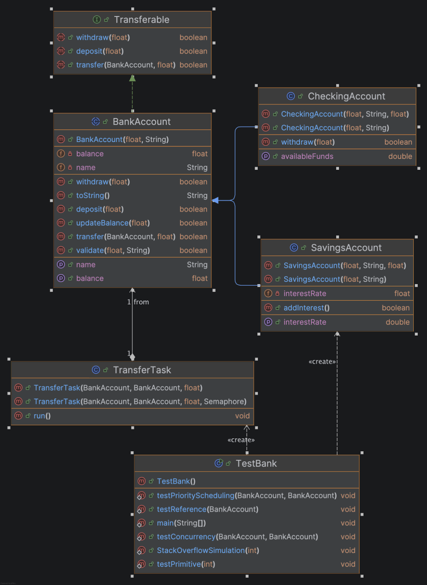

# 🏦 Simple Bank Account System (Java)

A small Java project demonstrating core Object-Oriented Programming (OOP) principles and memory behavior concepts using a `BankAccount` class and a `TestBank` driver class.

## 📌 Overview

This project demonstrates:

- Encapsulation
- Constructor usage
- Method validation
- Reference vs Primitive types
- Stack vs Heap memory behavior
- Recursion and stack overflow simulation
- String vs StringBuilder differences

It is designed for learning and academic purposes.

## System Design



## Task 1 – Stack Pointer Analysis

### Goal: Demonstrate Method Call Stack Behavior
- Create multiple nested method calls (e.g., deposit → validate → updateBalance).
- Show how each method call creates a stack frame (tracing call stack).
- Cause a StackOverflowError by creating excessive recursive calls (discussion).
- Document what happens when methods complete (stack unwinding) (explaining).

## Task 2 – Heap Allocation
### Goal: Demonstrate Object Creation in the Heap

- Create multiple BankAccount objects with different initial balances.
- Show how each object is allocated in the Heap (tracing call heap).
- Demonstrate what happens when references are reassigned (discussion).
- Trigger garbage collection scenario by nullifying references (explaining).

## Task 3 – Reference vs Primitive
### Goal: Demonstrate Parameter Passing Differences

- Show primitive types (e.g., balance as double) vs object references.
- Create methods that modify parameters.
- Demonstrate why changing the balance inside a method affects the original object (discussion).
- Compare with passing primitive values (discussion).
- Show String immutability in banking operations (demonstration and discussion).

## ⚙ Additional Tasks

#### 1. Scheduling Concepts

#### 2. Concurrency Concepts

## ▶ How to Run
```bash
javac *.java
java TestBank
```
